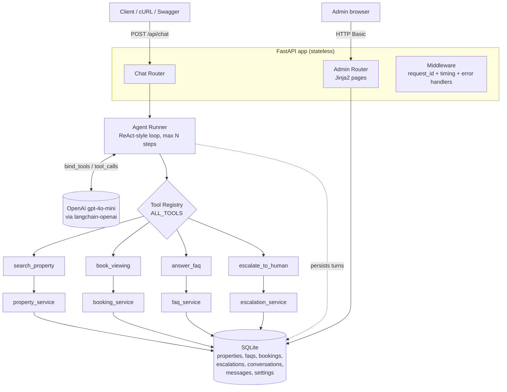

# PLAN.md — Real Estate AI Assistant (Agentic AI Backend)

## Context

This repo is my submission for a take-home technical assessment. The brief asks for a
**small but production-minded Agentic AI MVP**: a backend service for a Real Estate AI
Assistant that can (1) answer FAQs, (2) search properties, and (3) schedule property
viewings — where the AI **autonomously chooses** the right tool via LLM function calling,
with **no keyword-based if/else routing**.

The grading rubric weights *design judgment* far above feature count:

| Area | Weight |
|---|---|
| Software Architecture | 30% |
| Agentic AI Design | 25% |
| Backend Quality | 20% |
| AI Coding-Agent Workflow | 15% |
| Documentation & Communication | 10% |

So the plan optimises for: **clean layering, a tool registry that makes adding the 5th tool
trivial, an honest scaling story, and readable code I can defend live on camera** — not for
a big feature surface.

### Decisions locked in

| Decision | Choice | Why |
|---|---|---|
| Language | **Python 3.12** (to be installed) | Brief requires Python. 3.9 is installed but the entire modern stack now needs ≥3.10 — see below. |
| Agent framework | `langchain-core` + `langchain-openai`, `.bind_tools()` | Native OpenAI function calling, thin wrapper. No agent-executor magic I can't explain. |
| LLM | OpenAI `gpt-4o-mini` | Cheap, fast, strong tool calling. Model name is config, not hardcoded. |
| API | FastAPI | Auto Swagger at `/docs` doubles as a demo surface. |
| DB | SQLite (stdlib `sqlite3`) | Zero setup for the reviewer. Swap-to-Postgres is the scaling story. |
| Admin page | Jinja2 server-rendered | Pure Python, no npm/build step. |
| Tests | pytest + a fake LLM | Test suite runs green **without** an API key. |

### Step 0 — install Python 3.12 (do this first)

The machine currently has **Python 3.9.0 only**. Verified against PyPI today, the current
releases of `langchain-core`, `langchain-openai`, `langchain`, `fastapi`, `uvicorn`,
`openai`, `pytest` and `python-dotenv` **all declare `requires-python >= 3.10`**. Staying
on 3.9 would mean pinning the whole stack to superseded releases — the wrong trade for a
greenfield project, and something a reviewer would notice.

```powershell
winget install --id Python.Python.3.12 --exact
# open a NEW terminal afterwards, then confirm:
py -3.12 --version      # -> Python 3.12.10
```

`winget` is available on this machine and `Python.Python.3.12` (3.12.10) resolves. 3.12 —
not 3.13 — because it has the widest prebuilt-wheel coverage, so no C compiler is needed on
Windows. The existing 3.9 install is left untouched; `py -3.12` selects the new one.

### Code style rules

- Use `Optional[int]` / `List[dict]` from `typing` rather than `int | None`. Both work on
  3.12; the explicit form is easier to read and matches what Pydantic examples show.
- Use `datetime.now(timezone.utc)` for timestamps — never naive `datetime.now()`.

---

## Architecture

### Layers

```
HTTP  →  Router  →  Agent Runner  →  Tool  →  Service  →  Database
         (I/O)     (LLM loop)      (adapter) (business  (sqlite3)
                                              logic)
```

**The one rule that carries the 30%:** *tools contain no business logic.* A tool validates
its arguments and calls a service, then serialises the result to JSON. The service is the
only place business rules live. That means the same `booking_service.create_booking()` is
reachable from the agent, from a plain REST endpoint, from the admin page, and from a future
cron job or second agent — without duplication.

### Diagram (`docs/architecture.mmd` → export 1-page PNG)



### File tree

```
evdekimi-takehome-assignment/
├── .env.example
├── .gitignore
├── requirements.txt
├── README.md
├── PLAN.md
├── docs/
│   ├── ARCHITECTURE.md
│   ├── architecture.mmd
│   └── AI_USAGE.md
├── app/
│   ├── __init__.py
│   ├── main.py
│   ├── config.py
│   ├── logging_config.py
│   ├── errors.py
│   ├── schemas.py
│   ├── database.py
│   ├── seed.py
│   ├── agent/
│   │   ├── __init__.py
│   │   ├── prompts.py
│   │   ├── runner.py
│   │   └── tools/
│   │       ├── __init__.py          <-- the registry
│   │       ├── search_property.py
│   │       ├── book_viewing.py
│   │       ├── answer_faq.py
│   │       └── escalate_to_human.py
│   ├── services/
│   │   ├── __init__.py
│   │   ├── property_service.py
│   │   ├── booking_service.py
│   │   ├── faq_service.py
│   │   └── escalation_service.py
│   ├── routers/
│   │   ├── __init__.py
│   │   ├── health.py
│   │   ├── chat.py
│   │   └── admin.py
│   └── templates/
│       ├── base.html
│       ├── dashboard.html
│       ├── conversations.html
│       ├── conversation_detail.html
│       ├── prompt.html
│       ├── properties.html
│       └── escalations.html
└── tests/
    ├── __init__.py
    ├── conftest.py
    ├── test_services.py
    ├── test_tools.py
    ├── test_agent_loop.py
    └── test_api.py
```

---

## Setup

```powershell
# from the repo root
py -3.12 -m venv .venv
.\.venv\Scripts\Activate.ps1
python --version            # must print 3.12.x before continuing
pip install -r requirements.txt
copy .env.example .env      # then paste your OpenAI key into .env
python -m app.seed          # creates app.db and fills demo data
uvicorn app.main:app --reload
```

Open http://127.0.0.1:8000/docs (API) and http://127.0.0.1:8000/admin (login `admin` / `admin123`).

---

## Code

### `requirements.txt`

```
# Requires Python >= 3.10. Versions verified against PyPI.
fastapi==0.141.1
uvicorn==0.52.4
jinja2==3.1.6
python-multipart==0.0.32
python-dotenv==1.2.3
pydantic==2.13.4
pydantic-settings==2.11.0
langchain-core==1.6.0
langchain-openai==1.6.0
httpx==0.28.1
pytest==9.1.1
```

Note we depend on `langchain-core` + `langchain-openai` directly, **not** the `langchain`
meta-package. We only need the `@tool` decorator, the message classes, and
`ChatOpenAI.bind_tools()` — pulling in the full `langchain` package would add the agent
executors and chains we deliberately are not using. Fewer dependencies, less to explain.
(Verified: `langchain-core` 1.6.0 still exports `tool`, `AIMessage`, `ToolMessage`,
`HumanMessage`, `SystemMessage` from the same import paths used in the code below.)

### `.env.example`

```
OPENAI_API_KEY=sk-put-your-key-here
OPENAI_MODEL=gpt-4o-mini
MAX_TOOL_ITERATIONS=5
DATABASE_PATH=app.db
ADMIN_USERNAME=admin
ADMIN_PASSWORD=admin123
LOG_LEVEL=INFO
```

### `.gitignore`

```
.venv/
__pycache__/
*.pyc
.env
app.db
.pytest_cache/
```

---

### `app/config.py`

```python
"""All settings come from environment variables / .env - never hardcoded."""

from pydantic_settings import BaseSettings, SettingsConfigDict


class Settings(BaseSettings):
    model_config = SettingsConfigDict(env_file=".env", extra="ignore")

    openai_api_key: str = ""
    openai_model: str = "gpt-4o-mini"

    # Safety guard: stop the agent loop after this many tool rounds.
    max_tool_iterations: int = 5

    database_path: str = "app.db"

    admin_username: str = "admin"
    admin_password: str = "admin123"

    log_level: str = "INFO"


settings = Settings()
```

### `app/logging_config.py`

```python
"""One-line JSON logs so they can be shipped to Loki/CloudWatch later."""

import json
import logging
import sys


class JsonFormatter(logging.Formatter):
    def format(self, record):
        data = {
            "time": self.formatTime(record),
            "level": record.levelname,
            "logger": record.name,
            "message": record.getMessage(),
        }
        # Anything passed as logger.info("msg", extra={"extra_data": {...}})
        if hasattr(record, "extra_data"):
            data.update(record.extra_data)
        if record.exc_info:
            data["error"] = self.formatException(record.exc_info)
        return json.dumps(data)


def setup_logging(level="INFO"):
    handler = logging.StreamHandler(sys.stdout)
    handler.setFormatter(JsonFormatter())

    root = logging.getLogger()
    root.handlers = [handler]
    root.setLevel(level)

    # uvicorn is noisy by default
    logging.getLogger("uvicorn.access").setLevel(logging.WARNING)


def get_logger(name):
    return logging.getLogger(name)
```

### `app/errors.py`

```python
"""Custom exceptions. Each one maps to an HTTP status in main.py."""


class AppError(Exception):
    """Base class for errors we raise on purpose."""
    status_code = 500
    message = "Something went wrong."

    def __init__(self, message=None):
        super().__init__(message or self.message)
        if message:
            self.message = message


class NotFoundError(AppError):
    status_code = 404
    message = "Not found."


class ValidationError(AppError):
    status_code = 400
    message = "Invalid input."


class LLMError(AppError):
    status_code = 503
    message = "The AI service is unavailable right now. Please try again."
```

### `app/database.py`

```python
"""Thin sqlite3 helper. One place that knows about the DB connection."""

import sqlite3

from app.config import settings

SCHEMA = """
CREATE TABLE IF NOT EXISTS properties (
    id          INTEGER PRIMARY KEY AUTOINCREMENT,
    title       TEXT NOT NULL,
    city        TEXT NOT NULL,
    district    TEXT,
    property_type TEXT NOT NULL,
    bedrooms    INTEGER NOT NULL,
    price       INTEGER NOT NULL,
    currency    TEXT NOT NULL DEFAULT 'TRY',
    description TEXT,
    is_available INTEGER NOT NULL DEFAULT 1
);

CREATE TABLE IF NOT EXISTS faqs (
    id       INTEGER PRIMARY KEY AUTOINCREMENT,
    question TEXT NOT NULL,
    answer   TEXT NOT NULL,
    keywords TEXT NOT NULL
);

CREATE TABLE IF NOT EXISTS conversations (
    id         TEXT PRIMARY KEY,
    user_id    TEXT,
    created_at TEXT NOT NULL
);

CREATE TABLE IF NOT EXISTS messages (
    id              INTEGER PRIMARY KEY AUTOINCREMENT,
    conversation_id TEXT NOT NULL,
    role            TEXT NOT NULL,          -- user | assistant | tool
    content         TEXT NOT NULL,
    tool_name       TEXT,
    created_at      TEXT NOT NULL
);

CREATE TABLE IF NOT EXISTS bookings (
    id           INTEGER PRIMARY KEY AUTOINCREMENT,
    property_id  INTEGER NOT NULL,
    customer_name TEXT NOT NULL,
    customer_phone TEXT NOT NULL,
    slot         TEXT NOT NULL,
    status       TEXT NOT NULL DEFAULT 'confirmed',
    created_at   TEXT NOT NULL
);

CREATE TABLE IF NOT EXISTS escalations (
    id              INTEGER PRIMARY KEY AUTOINCREMENT,
    conversation_id TEXT,
    reason          TEXT NOT NULL,
    summary         TEXT,
    contact         TEXT,
    status          TEXT NOT NULL DEFAULT 'open',
    created_at      TEXT NOT NULL
);

CREATE TABLE IF NOT EXISTS settings (
    key   TEXT PRIMARY KEY,
    value TEXT NOT NULL
);

CREATE INDEX IF NOT EXISTS idx_messages_conv ON messages(conversation_id);
CREATE INDEX IF NOT EXISTS idx_properties_city ON properties(city);
"""


def get_connection():
    """Open a connection. row_factory lets us read rows like dictionaries."""
    conn = sqlite3.connect(settings.database_path)
    conn.row_factory = sqlite3.Row
    return conn


def init_db():
    conn = get_connection()
    conn.executescript(SCHEMA)
    conn.commit()
    conn.close()


def query_all(sql, params=()):
    conn = get_connection()
    rows = conn.execute(sql, params).fetchall()
    conn.close()
    return [dict(r) for r in rows]


def query_one(sql, params=()):
    rows = query_all(sql, params)
    return rows[0] if rows else None


def execute(sql, params=()):
    """Run an INSERT/UPDATE/DELETE. Returns the new row id."""
    conn = get_connection()
    cur = conn.execute(sql, params)
    conn.commit()
    new_id = cur.lastrowid
    conn.close()
    return new_id
```

### `app/seed.py`

```python
"""Run once: python -m app.seed"""

from app.agent.prompts import DEFAULT_SYSTEM_PROMPT
from app.database import execute, init_db, query_one

PROPERTIES = [
    ("Sunny 2+1 near the metro", "Istanbul", "Kadikoy", "apartment", 2, 4200000,
     "Bright corner flat, 5 min walk to Kadikoy metro, south facing balcony."),
    ("Modern 3+1 with sea view", "Istanbul", "Besiktas", "apartment", 3, 9500000,
     "Renovated in 2023, sea view from the living room, closed parking."),
    ("Quiet 1+1 studio", "Istanbul", "Sisli", "apartment", 1, 2750000,
     "Ideal for a single professional, furnished, 24/7 security."),
    ("Family villa with garden", "Izmir", "Urla", "villa", 4, 15800000,
     "Detached villa, 400 m2 garden, private pool, 10 min to the sea."),
    ("Seafront 2+1", "Izmir", "Karsiyaka", "apartment", 2, 5300000,
     "Directly on the promenade, open kitchen, elevator building."),
    ("Central 3+1 office-friendly", "Ankara", "Cankaya", "apartment", 3, 6100000,
     "Suitable for home office, close to embassies, underfloor heating."),
]

FAQS = [
    ("What documents do I need to buy a property?",
     "You need your ID or passport, a Turkish tax number, and for foreign buyers an "
     "official valuation report. We handle the title deed appointment for you.",
     "document,documents,paperwork,id,passport,tax number,title deed,tapu"),
    ("Do you charge a commission?",
     "Our commission is 2% of the sale price plus VAT, paid only after the sale closes. "
     "Viewings and consultations are free.",
     "commission,fee,fees,charge,cost,price of service,percentage"),
    ("Can foreigners buy property?",
     "Yes. Foreign nationals can buy residential property in Turkey. Purchases above "
     "USD 400,000 may also qualify the buyer for citizenship by investment.",
     "foreigner,foreigners,foreign,expat,citizenship,residence permit,visa"),
    ("How long does the purchase process take?",
     "Typically 2 to 4 weeks from accepted offer to title deed transfer, assuming the "
     "valuation report and paperwork are ready.",
     "how long,duration,timeline,process,take,weeks,days"),
    ("What are your office hours?",
     "Our offices are open Monday to Saturday, 09:00 to 18:00. Viewings can also be "
     "arranged on Sunday by appointment.",
     "office hours,open,opening,working hours,when,available,sunday"),
]


def seed():
    init_db()

    if not query_one("SELECT id FROM properties LIMIT 1"):
        for title, city, district, ptype, beds, price, desc in PROPERTIES:
            execute(
                "INSERT INTO properties "
                "(title, city, district, property_type, bedrooms, price, currency, description) "
                "VALUES (?, ?, ?, ?, ?, ?, 'TRY', ?)",
                (title, city, district, ptype, beds, price, desc),
            )
        print("Seeded %d properties." % len(PROPERTIES))

    if not query_one("SELECT id FROM faqs LIMIT 1"):
        for question, answer, keywords in FAQS:
            execute(
                "INSERT INTO faqs (question, answer, keywords) VALUES (?, ?, ?)",
                (question, answer, keywords),
            )
        print("Seeded %d FAQs." % len(FAQS))

    if not query_one("SELECT key FROM settings WHERE key = 'system_prompt'"):
        execute(
            "INSERT INTO settings (key, value) VALUES ('system_prompt', ?)",
            (DEFAULT_SYSTEM_PROMPT,),
        )
        print("Seeded default system prompt.")

    print("Database ready at %s" % __import__("app.config", fromlist=["settings"]).settings.database_path)


if __name__ == "__main__":
    seed()
```

---

### Services (business logic layer)

#### `app/services/property_service.py`

```python
from typing import List, Optional

from app.database import query_all, query_one
from app.errors import NotFoundError


def search(city: Optional[str] = None,
           property_type: Optional[str] = None,
           min_bedrooms: Optional[int] = None,
           max_price: Optional[int] = None,
           limit: int = 5) -> List[dict]:
    """Filter available properties. Every filter is optional."""
    sql = "SELECT * FROM properties WHERE is_available = 1"
    params = []

    if city:
        sql += " AND LOWER(city) = LOWER(?)"
        params.append(city)
    if property_type:
        sql += " AND LOWER(property_type) = LOWER(?)"
        params.append(property_type)
    if min_bedrooms is not None:
        sql += " AND bedrooms >= ?"
        params.append(min_bedrooms)
    if max_price is not None:
        sql += " AND price <= ?"
        params.append(max_price)

    sql += " ORDER BY price ASC LIMIT ?"
    params.append(limit)

    return query_all(sql, tuple(params))


def get_by_id(property_id: int) -> dict:
    row = query_one("SELECT * FROM properties WHERE id = ?", (property_id,))
    if not row:
        raise NotFoundError("Property %s does not exist." % property_id)
    return row


def list_all() -> List[dict]:
    return query_all("SELECT * FROM properties ORDER BY id")
```

#### `app/services/booking_service.py`

```python
from datetime import datetime, timezone
from typing import List

from app.database import execute, query_all, query_one
from app.errors import ValidationError
from app.services import property_service

# In a real system these would come from an agent's calendar.
AVAILABLE_SLOTS = [
    "2026-08-22 10:00",
    "2026-08-22 14:00",
    "2026-08-23 11:00",
    "2026-08-24 16:00",
]


def _now() -> str:
    return datetime.now(timezone.utc).isoformat()


def list_slots(property_id: int) -> List[str]:
    property_service.get_by_id(property_id)  # raises NotFoundError if missing
    taken = [r["slot"] for r in query_all(
        "SELECT slot FROM bookings WHERE property_id = ? AND status = 'confirmed'",
        (property_id,),
    )]
    return [s for s in AVAILABLE_SLOTS if s not in taken]


def create_booking(property_id: int, customer_name: str,
                   customer_phone: str, slot: str) -> dict:
    prop = property_service.get_by_id(property_id)

    if slot not in AVAILABLE_SLOTS:
        raise ValidationError(
            "Slot '%s' is not offered. Available slots: %s"
            % (slot, ", ".join(AVAILABLE_SLOTS))
        )

    already = query_one(
        "SELECT id FROM bookings WHERE property_id = ? AND slot = ? AND status = 'confirmed'",
        (property_id, slot),
    )
    if already:
        raise ValidationError("That slot is already booked. Please pick another one.")

    booking_id = execute(
        "INSERT INTO bookings (property_id, customer_name, customer_phone, slot, created_at) "
        "VALUES (?, ?, ?, ?, ?)",
        (property_id, customer_name, customer_phone, slot, _now()),
    )

    return {
        "booking_id": booking_id,
        "property_id": property_id,
        "property_title": prop["title"],
        "customer_name": customer_name,
        "slot": slot,
        "status": "confirmed",
    }


def list_all() -> List[dict]:
    return query_all(
        "SELECT b.*, p.title AS property_title "
        "FROM bookings b LEFT JOIN properties p ON p.id = b.property_id "
        "ORDER BY b.id DESC"
    )
```

#### `app/services/faq_service.py`

```python
from typing import List

from app.database import query_all


def search(question: str, limit: int = 3) -> List[dict]:
    """Score each FAQ by how many of its keywords appear in the question.

    This is deliberately simple. It is *not* the agent's routing logic - the LLM
    already decided to call this tool. Swapping this for pgvector/embeddings later
    only changes this one function.
    """
    asked = question.lower()
    scored = []

    for faq in query_all("SELECT * FROM faqs"):
        keywords = [k.strip() for k in faq["keywords"].split(",") if k.strip()]
        score = sum(1 for k in keywords if k in asked)
        if score:
            scored.append((score, faq))

    scored.sort(key=lambda pair: pair[0], reverse=True)
    return [faq for _, faq in scored[:limit]]


def list_all() -> List[dict]:
    return query_all("SELECT * FROM faqs ORDER BY id")
```

#### `app/services/escalation_service.py`

```python
from datetime import datetime, timezone
from typing import List, Optional

from app.database import execute, query_all


def create(reason: str, summary: str = "",
           contact: Optional[str] = None,
           conversation_id: Optional[str] = None) -> dict:
    escalation_id = execute(
        "INSERT INTO escalations (conversation_id, reason, summary, contact, created_at) "
        "VALUES (?, ?, ?, ?, ?)",
        (conversation_id, reason, summary, contact,
         datetime.now(timezone.utc).isoformat()),
    )
    return {
        "escalation_id": escalation_id,
        "status": "open",
        "message": "A human agent has been notified and will contact you shortly.",
    }


def list_all() -> List[dict]:
    return query_all("SELECT * FROM escalations ORDER BY id DESC")


def close(escalation_id: int) -> None:
    execute("UPDATE escalations SET status = 'closed' WHERE id = ?", (escalation_id,))
```

---

### Agent layer

#### `app/agent/prompts.py`

```python
"""The system prompt describes the ROLE, not routing rules.

Note what is NOT here: no 'if the user says price then call answer_faq'.
Tool selection is left entirely to the model - that is the requirement.
"""

DEFAULT_SYSTEM_PROMPT = """You are Eva, a helpful real estate assistant for a Turkish \
property agency.

You help customers with three things: answering questions about our agency and the \
buying process, finding properties that match what they want, and booking viewing \
appointments.

Guidelines:
- Use the tools available to you to get real information. Never invent property \
details, prices, availability, or policies.
- Before booking a viewing you need a property, the customer's full name, their phone \
number, and a time slot. Ask for whatever is missing instead of guessing.
- If the customer asks for something outside your abilities, seems frustrated, asks to \
speak to a person, or wants to negotiate price or legal terms, hand the conversation to \
a human colleague.
- Keep replies short and friendly. Use the customer's language.
"""


def get_system_prompt() -> str:
    """Read the live prompt from the database so admins can edit it without a deploy."""
    from app.database import query_one

    row = query_one("SELECT value FROM settings WHERE key = 'system_prompt'")
    return row["value"] if row else DEFAULT_SYSTEM_PROMPT


def set_system_prompt(value: str) -> None:
    from app.database import execute

    execute(
        "INSERT INTO settings (key, value) VALUES ('system_prompt', ?) "
        "ON CONFLICT(key) DO UPDATE SET value = excluded.value",
        (value,),
    )
```

#### `app/agent/tools/search_property.py`

```python
"""Tool = thin adapter. It validates arguments and calls the service. No logic here."""

import json
from typing import Optional

from langchain_core.tools import tool

from app.services import property_service


@tool
def search_property(city: Optional[str] = None,
                    property_type: Optional[str] = None,
                    min_bedrooms: Optional[int] = None,
                    max_price: Optional[int] = None) -> str:
    """Search the agency's available property listings.

    Use this whenever the customer describes what kind of home they are looking for,
    or asks what is available. All filters are optional - pass only what the customer
    actually mentioned.

    Args:
        city: City name, for example "Istanbul", "Izmir" or "Ankara".
        property_type: Either "apartment" or "villa".
        min_bedrooms: Minimum number of bedrooms the customer needs.
        max_price: Maximum budget in Turkish Lira.
    """
    results = property_service.search(
        city=city,
        property_type=property_type,
        min_bedrooms=min_bedrooms,
        max_price=max_price,
    )

    if not results:
        return json.dumps({
            "count": 0,
            "message": "No properties matched those filters. Suggest relaxing the "
                       "budget or trying a nearby city.",
        })

    return json.dumps({"count": len(results), "properties": results})
```

#### `app/agent/tools/book_viewing.py`

```python
import json

from langchain_core.tools import tool

from app.errors import AppError
from app.services import booking_service


@tool
def book_viewing(property_id: int, customer_name: str,
                 customer_phone: str, slot: str) -> str:
    """Book a viewing appointment for a specific property.

    Only call this once you know all four arguments. If the customer has not given
    their name, phone number, or a preferred time, ask them first. If they do not
    know which slots exist, call this tool with the property_id and any placeholder
    values is NOT allowed - instead call list_viewing_slots.

    Args:
        property_id: The id of the property, taken from search_property results.
        customer_name: The customer's full name.
        customer_phone: A phone number we can reach the customer on.
        slot: The chosen time, formatted "YYYY-MM-DD HH:MM".
    """
    try:
        booking = booking_service.create_booking(
            property_id=property_id,
            customer_name=customer_name,
            customer_phone=customer_phone,
            slot=slot,
        )
    except AppError as exc:
        # Give the model a readable reason so it can recover on the next turn.
        return json.dumps({"success": False, "error": exc.message})

    return json.dumps({"success": True, "booking": booking})


@tool
def list_viewing_slots(property_id: int) -> str:
    """List the viewing times still free for one property.

    Call this before book_viewing when the customer has not named a specific time.

    Args:
        property_id: The id of the property, taken from search_property results.
    """
    try:
        slots = booking_service.list_slots(property_id)
    except AppError as exc:
        return json.dumps({"success": False, "error": exc.message})

    return json.dumps({"property_id": property_id, "available_slots": slots})
```

#### `app/agent/tools/answer_faq.py`

```python
import json

from langchain_core.tools import tool

from app.services import faq_service


@tool
def answer_faq(question: str) -> str:
    """Look up the agency's official answer to a common customer question.

    Use this for questions about commissions and fees, required documents, whether
    foreigners can buy, how long the purchase takes, office hours, and similar
    policy questions. Always prefer this over answering from your own knowledge.

    Args:
        question: The customer's question, in their own words.
    """
    matches = faq_service.search(question)

    if not matches:
        return json.dumps({
            "found": False,
            "message": "No official answer on file. Do not guess - offer to connect "
                       "the customer with a human colleague instead.",
        })

    return json.dumps({
        "found": True,
        "answers": [{"question": m["question"], "answer": m["answer"]} for m in matches],
    })
```

#### `app/agent/tools/escalate_to_human.py`

```python
import json
from typing import Optional

from langchain_core.tools import tool

from app.services import escalation_service


@tool
def escalate_to_human(reason: str, summary: str,
                      contact: Optional[str] = None) -> str:
    """Hand the conversation over to a human colleague.

    Use this when the customer explicitly asks for a person, when they are unhappy,
    when they want to negotiate the price or discuss legal or mortgage details, or
    when you genuinely cannot help with the tools you have.

    Args:
        reason: Short category, for example "price negotiation" or "customer request".
        summary: One or two sentences a colleague can read to pick up the conversation.
        contact: The customer's phone or email, if they have given one.
    """
    result = escalation_service.create(reason=reason, summary=summary, contact=contact)
    return json.dumps(result)
```

#### `app/agent/tools/__init__.py` — **the registry**

```python
"""Tool registry.

This is the extensibility seam. To add a capability:
  1. create a new file in this folder with an @tool function,
  2. import it here and add it to ALL_TOOLS.

Nothing else in the codebase changes - not the runner, not the router, not the prompt.
A future second agent (for example a landlord-facing agent) can simply be given a
different subset of this list.
"""

from app.agent.tools.answer_faq import answer_faq
from app.agent.tools.book_viewing import book_viewing, list_viewing_slots
from app.agent.tools.escalate_to_human import escalate_to_human
from app.agent.tools.search_property import search_property

ALL_TOOLS = [
    search_property,
    list_viewing_slots,
    book_viewing,
    answer_faq,
    escalate_to_human,
]

TOOLS_BY_NAME = {t.name: t for t in ALL_TOOLS}
```

#### `app/agent/runner.py` — the loop

```python
"""The agent loop.

Pattern: send the conversation to the model, and if the model asks for tools, run
them, append the results, and send it back. Repeat until the model replies with
plain text or we hit the iteration cap.

The model - not our code - decides which tool to call. There is no keyword routing
anywhere in this file.
"""

import json
import uuid
from datetime import datetime, timezone
from typing import List, Optional

from langchain_core.messages import AIMessage, HumanMessage, SystemMessage, ToolMessage
from langchain_openai import ChatOpenAI

from app.agent.prompts import get_system_prompt
from app.agent.tools import ALL_TOOLS, TOOLS_BY_NAME
from app.config import settings
from app.database import execute, query_all, query_one
from app.errors import LLMError
from app.logging_config import get_logger

logger = get_logger(__name__)

FALLBACK_REPLY = (
    "Sorry, I got stuck working that out. Let me pass you to a colleague who can help."
)


def _now() -> str:
    return datetime.now(timezone.utc).isoformat()


def build_llm():
    """Separate function so tests can replace it with a fake."""
    if not settings.openai_api_key:
        raise LLMError("OPENAI_API_KEY is not set.")

    llm = ChatOpenAI(
        model=settings.openai_model,
        api_key=settings.openai_api_key,
        temperature=0,
        timeout=30,
        max_retries=2,
    )
    return llm.bind_tools(ALL_TOOLS)


# ---------------------------------------------------------------- conversation

def ensure_conversation(conversation_id: Optional[str], user_id: Optional[str]) -> str:
    if conversation_id and query_one(
        "SELECT id FROM conversations WHERE id = ?", (conversation_id,)
    ):
        return conversation_id

    new_id = conversation_id or str(uuid.uuid4())
    execute(
        "INSERT INTO conversations (id, user_id, created_at) VALUES (?, ?, ?)",
        (new_id, user_id, _now()),
    )
    return new_id


def save_message(conversation_id: str, role: str, content: str,
                 tool_name: Optional[str] = None) -> None:
    execute(
        "INSERT INTO messages (conversation_id, role, content, tool_name, created_at) "
        "VALUES (?, ?, ?, ?, ?)",
        (conversation_id, role, content, tool_name, _now()),
    )


def load_history(conversation_id: str, limit: int = 20) -> List:
    """Rebuild LangChain messages from the database.

    Only user and assistant turns are replayed. Tool results are intentionally left
    out to keep the context small - the assistant reply already summarises them.
    """
    rows = query_all(
        "SELECT role, content FROM messages "
        "WHERE conversation_id = ? AND role IN ('user', 'assistant') "
        "ORDER BY id DESC LIMIT ?",
        (conversation_id, limit),
    )
    rows.reverse()

    history = []
    for row in rows:
        if row["role"] == "user":
            history.append(HumanMessage(content=row["content"]))
        else:
            history.append(AIMessage(content=row["content"]))
    return history


# ---------------------------------------------------------------------- tools

def run_tool(name: str, args: dict) -> str:
    """Run one tool. A failing tool must never crash the request."""
    tool = TOOLS_BY_NAME.get(name)
    if tool is None:
        return json.dumps({"error": "Unknown tool '%s'." % name})

    try:
        return tool.invoke(args)
    except Exception as exc:  # noqa: BLE001 - we want to report anything back to the model
        logger.exception("Tool failed", extra={"extra_data": {"tool": name}})
        return json.dumps({"error": "Tool '%s' failed: %s" % (name, exc)})


# ----------------------------------------------------------------- the loop

def run_agent(user_message: str,
              conversation_id: Optional[str] = None,
              user_id: Optional[str] = None,
              llm=None) -> dict:
    conversation_id = ensure_conversation(conversation_id, user_id)
    save_message(conversation_id, "user", user_message)

    llm = llm or build_llm()

    messages = [SystemMessage(content=get_system_prompt())]
    messages.extend(load_history(conversation_id))
    messages.append(HumanMessage(content=user_message))

    tools_used = []

    for step in range(settings.max_tool_iterations):
        try:
            ai_message = llm.invoke(messages)
        except Exception as exc:  # network error, bad key, rate limit, ...
            logger.exception("LLM call failed",
                             extra={"extra_data": {"conversation_id": conversation_id}})
            save_message(conversation_id, "assistant", FALLBACK_REPLY)
            raise LLMError(str(exc))

        messages.append(ai_message)

        # No tool calls means the model is done and this is the final answer.
        if not ai_message.tool_calls:
            reply = ai_message.content or FALLBACK_REPLY
            save_message(conversation_id, "assistant", reply)
            logger.info("Agent finished", extra={"extra_data": {
                "conversation_id": conversation_id,
                "steps": step + 1,
                "tools_used": tools_used,
            }})
            return {
                "conversation_id": conversation_id,
                "reply": reply,
                "tools_used": tools_used,
                "steps": step + 1,
            }

        for call in ai_message.tool_calls:
            logger.info("Tool call", extra={"extra_data": {
                "conversation_id": conversation_id,
                "tool": call["name"],
                "args": call["args"],
            }})

            result = run_tool(call["name"], call["args"])
            tools_used.append(call["name"])
            save_message(conversation_id, "tool", result, tool_name=call["name"])

            messages.append(ToolMessage(content=result, tool_call_id=call["id"]))

    # Safety net: the model kept asking for tools and never settled.
    logger.warning("Iteration cap reached",
                   extra={"extra_data": {"conversation_id": conversation_id}})
    save_message(conversation_id, "assistant", FALLBACK_REPLY)
    return {
        "conversation_id": conversation_id,
        "reply": FALLBACK_REPLY,
        "tools_used": tools_used,
        "steps": settings.max_tool_iterations,
    }
```

---

### API layer

#### `app/schemas.py`

```python
from typing import List, Optional

from pydantic import BaseModel, Field


class ChatRequest(BaseModel):
    message: str = Field(..., min_length=1, max_length=2000)
    conversation_id: Optional[str] = None
    user_id: Optional[str] = None


class ChatResponse(BaseModel):
    conversation_id: str
    reply: str
    tools_used: List[str]
    steps: int


class ErrorResponse(BaseModel):
    error: str
    request_id: Optional[str] = None
```

#### `app/routers/health.py`

```python
from fastapi import APIRouter

from app.agent.tools import ALL_TOOLS
from app.config import settings

router = APIRouter(tags=["system"])


@router.get("/health")
def health():
    return {
        "status": "ok",
        "model": settings.openai_model,
        "tools": [t.name for t in ALL_TOOLS],
    }
```

#### `app/routers/chat.py`

```python
from fastapi import APIRouter

from app.agent.runner import run_agent
from app.logging_config import get_logger
from app.schemas import ChatRequest, ChatResponse

router = APIRouter(prefix="/api", tags=["chat"])
logger = get_logger(__name__)


@router.post("/chat", response_model=ChatResponse)
def chat(payload: ChatRequest):
    """Send one message to the assistant and get its reply.

    The endpoint is stateless - conversation state lives in the database, so any
    replica can serve any request.
    """
    logger.info("Chat request", extra={"extra_data": {
        "conversation_id": payload.conversation_id,
        "user_id": payload.user_id,
    }})

    result = run_agent(
        user_message=payload.message,
        conversation_id=payload.conversation_id,
        user_id=payload.user_id,
    )
    return ChatResponse(**result)
```

#### `app/routers/admin.py`

```python
"""Server-rendered admin pages. Protected with HTTP Basic auth."""

import secrets

from fastapi import APIRouter, Depends, Form, HTTPException, Request, status
from fastapi.responses import RedirectResponse
from fastapi.security import HTTPBasic, HTTPBasicCredentials
from fastapi.templating import Jinja2Templates

from app.agent.prompts import get_system_prompt, set_system_prompt
from app.config import settings
from app.database import query_all
from app.services import booking_service, escalation_service, faq_service, property_service

router = APIRouter(prefix="/admin", tags=["admin"])
templates = Jinja2Templates(directory="app/templates")
security = HTTPBasic()


def require_admin(credentials: HTTPBasicCredentials = Depends(security)):
    user_ok = secrets.compare_digest(credentials.username, settings.admin_username)
    pass_ok = secrets.compare_digest(credentials.password, settings.admin_password)
    if not (user_ok and pass_ok):
        raise HTTPException(
            status_code=status.HTTP_401_UNAUTHORIZED,
            detail="Invalid admin credentials.",
            headers={"WWW-Authenticate": "Basic"},
        )
    return credentials.username


@router.get("")
def dashboard(request: Request, _=Depends(require_admin)):
    stats = {
        "conversations": len(query_all("SELECT id FROM conversations")),
        "messages": len(query_all("SELECT id FROM messages")),
        "bookings": len(booking_service.list_all()),
        "escalations": len([e for e in escalation_service.list_all()
                            if e["status"] == "open"]),
        "properties": len(property_service.list_all()),
        "faqs": len(faq_service.list_all()),
    }
    return templates.TemplateResponse(
        "dashboard.html", {"request": request, "stats": stats, "model": settings.openai_model}
    )


@router.get("/prompt")
def prompt_page(request: Request, _=Depends(require_admin)):
    return templates.TemplateResponse(
        "prompt.html", {"request": request, "prompt": get_system_prompt(), "saved": False}
    )


@router.post("/prompt")
def prompt_save(request: Request, system_prompt: str = Form(...), _=Depends(require_admin)):
    set_system_prompt(system_prompt)
    return templates.TemplateResponse(
        "prompt.html", {"request": request, "prompt": system_prompt, "saved": True}
    )


@router.get("/conversations")
def conversations(request: Request, _=Depends(require_admin)):
    rows = query_all(
        "SELECT c.id, c.user_id, c.created_at, COUNT(m.id) AS message_count "
        "FROM conversations c LEFT JOIN messages m ON m.conversation_id = c.id "
        "GROUP BY c.id ORDER BY c.created_at DESC"
    )
    return templates.TemplateResponse(
        "conversations.html", {"request": request, "conversations": rows}
    )


@router.get("/conversations/{conversation_id}")
def conversation_detail(conversation_id: str, request: Request, _=Depends(require_admin)):
    messages = query_all(
        "SELECT * FROM messages WHERE conversation_id = ? ORDER BY id", (conversation_id,)
    )
    return templates.TemplateResponse(
        "conversation_detail.html",
        {"request": request, "conversation_id": conversation_id, "messages": messages},
    )


@router.get("/properties")
def properties(request: Request, _=Depends(require_admin)):
    return templates.TemplateResponse(
        "properties.html",
        {"request": request,
         "properties": property_service.list_all(),
         "bookings": booking_service.list_all()},
    )


@router.get("/escalations")
def escalations(request: Request, _=Depends(require_admin)):
    return templates.TemplateResponse(
        "escalations.html",
        {"request": request, "escalations": escalation_service.list_all()},
    )


@router.post("/escalations/{escalation_id}/close")
def close_escalation(escalation_id: int, _=Depends(require_admin)):
    escalation_service.close(escalation_id)
    return RedirectResponse("/admin/escalations", status_code=303)
```

#### `app/main.py`

```python
import time
import uuid

from fastapi import FastAPI, Request
from fastapi.exceptions import RequestValidationError
from fastapi.responses import JSONResponse

from app.config import settings
from app.database import init_db
from app.errors import AppError
from app.logging_config import get_logger, setup_logging
from app.routers import admin, chat, health

setup_logging(settings.log_level)
logger = get_logger(__name__)

app = FastAPI(
    title="Real Estate AI Assistant",
    description="Agentic backend. The LLM chooses tools autonomously.",
    version="1.0.0",
)

app.include_router(health.router)
app.include_router(chat.router)
app.include_router(admin.router)


@app.on_event("startup")
def on_startup():
    init_db()
    logger.info("Service started", extra={"extra_data": {"model": settings.openai_model}})


@app.middleware("http")
async def add_request_id(request: Request, call_next):
    """Tag every request so its logs can be traced end to end."""
    request_id = str(uuid.uuid4())[:8]
    request.state.request_id = request_id
    started = time.time()

    response = await call_next(request)

    logger.info("Request handled", extra={"extra_data": {
        "request_id": request_id,
        "method": request.method,
        "path": request.url.path,
        "status": response.status_code,
        "duration_ms": round((time.time() - started) * 1000, 1),
    }})
    response.headers["X-Request-ID"] = request_id
    return response


@app.exception_handler(AppError)
async def app_error_handler(request: Request, exc: AppError):
    request_id = getattr(request.state, "request_id", None)
    logger.warning("Handled error", extra={"extra_data": {
        "request_id": request_id, "error": exc.message,
    }})
    return JSONResponse(
        status_code=exc.status_code,
        content={"error": exc.message, "request_id": request_id},
    )


@app.exception_handler(RequestValidationError)
async def validation_error_handler(request: Request, exc: RequestValidationError):
    return JSONResponse(
        status_code=422,
        content={"error": "Invalid request body.", "details": exc.errors()},
    )


@app.exception_handler(Exception)
async def unhandled_error_handler(request: Request, exc: Exception):
    """Never leak a stack trace to the client."""
    request_id = getattr(request.state, "request_id", None)
    logger.exception("Unhandled error", extra={"extra_data": {"request_id": request_id}})
    return JSONResponse(
        status_code=500,
        content={"error": "Internal server error.", "request_id": request_id},
    )
```

---

### Templates

#### `app/templates/base.html`

```html
<!doctype html>
<html lang="en">
<head>
  <meta charset="utf-8">
  <meta name="viewport" content="width=device-width, initial-scale=1">
  <title>Admin — Real Estate AI</title>
  <style>
    body { font-family: system-ui, sans-serif; margin: 0; background: #f6f7f9; color: #1a1a1a; }
    header { background: #1f2937; color: #fff; padding: 14px 24px; }
    header a { color: #d1d5db; text-decoration: none; margin-right: 18px; font-size: 14px; }
    header a:hover { color: #fff; }
    main { padding: 24px; max-width: 1000px; }
    h1 { font-size: 20px; }
    table { border-collapse: collapse; width: 100%; background: #fff; font-size: 14px; }
    th, td { text-align: left; padding: 8px 10px; border-bottom: 1px solid #e5e7eb; }
    th { background: #f3f4f6; }
    .cards { display: flex; gap: 12px; flex-wrap: wrap; }
    .card { background: #fff; border: 1px solid #e5e7eb; border-radius: 8px;
            padding: 16px 20px; min-width: 130px; }
    .card b { display: block; font-size: 26px; }
    .card span { color: #6b7280; font-size: 13px; }
    textarea { width: 100%; height: 300px; font-family: ui-monospace, monospace;
               font-size: 13px; padding: 10px; }
    button { background: #2563eb; color: #fff; border: 0; padding: 8px 16px;
             border-radius: 6px; cursor: pointer; }
    .role-user { color: #2563eb; } .role-assistant { color: #059669; }
    .role-tool { color: #b45309; font-family: ui-monospace, monospace; font-size: 12px; }
    .ok { background: #dcfce7; padding: 8px 12px; border-radius: 6px; }
  </style>
</head>
<body>
  <header>
    <a href="/admin">Dashboard</a>
    <a href="/admin/conversations">Conversations</a>
    <a href="/admin/prompt">Prompt</a>
    <a href="/admin/properties">Properties &amp; Bookings</a>
    <a href="/admin/escalations">Escalations</a>
    <a href="/docs">API docs</a>
  </header>
  <main></main>
</body>
</html>
```

#### `app/templates/dashboard.html`

```html

Dashboard

<h1>Dashboard</h1>
<p>Model in use: <b>{{ model }}</b></p>
<div class="cards">
  <div class="card"><b>{{ stats.conversations }}</b><span>Conversations</span></div>
  <div class="card"><b>{{ stats.messages }}</b><span>Messages</span></div>
  <div class="card"><b>{{ stats.bookings }}</b><span>Bookings</span></div>
  <div class="card"><b>{{ stats.escalations }}</b><span>Open escalations</span></div>
  <div class="card"><b>{{ stats.properties }}</b><span>Properties</span></div>
  <div class="card"><b>{{ stats.faqs }}</b><span>FAQs</span></div>
</div>

```

#### `app/templates/prompt.html`

```html

Prompt

<h1>System prompt</h1>
<p class="ok">Saved. It applies to the next message immediately.</p>
<p>Edited here and stored in the database, so behaviour can be tuned without a deploy.</p>
<form method="post">
  <textarea name="system_prompt">{{ prompt }}</textarea>
  <p><button type="submit">Save prompt</button></p>
</form>

```

#### `app/templates/conversations.html`

```html

Conversations

<h1>Conversations</h1>
<table>
  <tr><th>ID</th><th>User</th><th>Messages</th><th>Started</th></tr>
  
  <tr>
    <td><a href="/admin/conversations/{{ c.id }}">{{ c.id[:8] }}</a></td>
    <td>{{ c.user_id or "-" }}</td>
    <td>{{ c.message_count }}</td>
    <td>{{ c.created_at[:19] }}</td>
  </tr>
  
  <tr><td colspan="4">No conversations yet.</td></tr>
  
</table>

```

#### `app/templates/conversation_detail.html`

```html

Conversation

<h1>Conversation {{ conversation_id[:8] }}</h1>
<p><a href="/admin/conversations">&larr; back</a></p>
<table>
  <tr><th>Role</th><th>Tool</th><th>Content</th><th>Time</th></tr>
  
  <tr>
    <td class="role-{{ m.role }}">{{ m.role }}</td>
    <td>{{ m.tool_name or "-" }}</td>
    <td class="role-tool">{{ m.content }}</td>
    <td>{{ m.created_at[11:19] }}</td>
  </tr>
  
</table>

```

#### `app/templates/properties.html`

```html

Properties

<h1>Properties</h1>
<table>
  <tr><th>ID</th><th>Title</th><th>City</th><th>Type</th><th>Beds</th><th>Price</th></tr>
  
  <tr>
    <td>{{ p.id }}</td><td>{{ p.title }}</td><td>{{ p.city }} / {{ p.district }}</td>
    <td>{{ p.property_type }}</td><td>{{ p.bedrooms }}</td>
    <td>{{ "{:,}".format(p.price) }} {{ p.currency }}</td>
  </tr>
  
</table>

<h1>Bookings</h1>
<table>
  <tr><th>ID</th><th>Property</th><th>Customer</th><th>Phone</th><th>Slot</th><th>Status</th></tr>
  
  <tr>
    <td>{{ b.id }}</td><td>{{ b.property_title }}</td><td>{{ b.customer_name }}</td>
    <td>{{ b.customer_phone }}</td><td>{{ b.slot }}</td><td>{{ b.status }}</td>
  </tr>
  
  <tr><td colspan="6">No bookings yet.</td></tr>
  
</table>

```

#### `app/templates/escalations.html`

```html

Escalations

<h1>Escalations</h1>
<table>
  <tr><th>ID</th><th>Reason</th><th>Summary</th><th>Contact</th><th>Status</th><th></th></tr>
  
  <tr>
    <td>{{ e.id }}</td><td>{{ e.reason }}</td><td>{{ e.summary }}</td>
    <td>{{ e.contact or "-" }}</td><td>{{ e.status }}</td>
    <td>
      
      <form method="post" action="/admin/escalations/{{ e.id }}/close">
        <button type="submit">Close</button>
      </form>
      
    </td>
  </tr>
  
  <tr><td colspan="6">No escalations.</td></tr>
  
</table>

```

---

### Tests (run green without an API key)

#### `tests/conftest.py`

```python
import os
import tempfile

import pytest

# Point the app at a throwaway database BEFORE anything imports settings.
os.environ["DATABASE_PATH"] = os.path.join(tempfile.mkdtemp(), "test.db")
os.environ["OPENAI_API_KEY"] = "test-key-not-used"


@pytest.fixture(autouse=True)
def fresh_db():
    from app.seed import seed
    seed()
    yield
```

#### `tests/test_services.py`

```python
import pytest

from app.errors import ValidationError
from app.services import booking_service, faq_service, property_service


def test_search_filters_by_city_and_budget():
    results = property_service.search(city="Istanbul", max_price=5000000)
    assert results
    assert all(r["city"] == "Istanbul" and r["price"] <= 5000000 for r in results)


def test_search_returns_empty_for_impossible_filters():
    assert property_service.search(city="Atlantis") == []


def test_faq_search_matches_keywords():
    results = faq_service.search("how much is your commission?")
    assert results
    assert "commission" in results[0]["question"].lower()


def test_double_booking_is_rejected():
    slot = booking_service.list_slots(1)[0]
    booking_service.create_booking(1, "Ada Lovelace", "+905550001", slot)
    with pytest.raises(ValidationError):
        booking_service.create_booking(1, "Alan Turing", "+905550002", slot)
```

#### `tests/test_tools.py`

```python
import json

from app.agent.tools import ALL_TOOLS, TOOLS_BY_NAME


def test_every_tool_has_a_description_for_the_model():
    for tool in ALL_TOOLS:
        assert tool.description, "%s has no docstring" % tool.name


def test_search_property_tool_returns_json():
    payload = json.loads(TOOLS_BY_NAME["search_property"].invoke({"city": "Izmir"}))
    assert payload["count"] >= 1


def test_book_viewing_reports_errors_instead_of_raising():
    payload = json.loads(TOOLS_BY_NAME["book_viewing"].invoke({
        "property_id": 999, "customer_name": "X",
        "customer_phone": "0", "slot": "2026-08-22 10:00",
    }))
    assert payload["success"] is False
    assert "error" in payload
```

#### `tests/test_agent_loop.py`

```python
"""Proves the loop works without spending a cent on OpenAI."""

from langchain_core.messages import AIMessage

from app.agent import runner


class FakeLLM:
    """Replays a scripted list of AIMessages, one per invoke() call."""

    def __init__(self, replies):
        self.replies = list(replies)
        self.seen_messages = []

    def invoke(self, messages):
        self.seen_messages.append(messages)
        return self.replies.pop(0)


def test_agent_runs_a_tool_then_answers():
    fake = FakeLLM([
        AIMessage(content="", tool_calls=[{
            "name": "search_property",
            "args": {"city": "Izmir"},
            "id": "call_1",
        }]),
        AIMessage(content="I found 2 places in Izmir."),
    ])

    result = runner.run_agent("Anything in Izmir?", llm=fake)

    assert result["tools_used"] == ["search_property"]
    assert result["reply"] == "I found 2 places in Izmir."
    assert result["steps"] == 2


def test_agent_answers_directly_when_no_tool_is_needed():
    fake = FakeLLM([AIMessage(content="Hello! How can I help?")])
    result = runner.run_agent("hi", llm=fake)
    assert result["tools_used"] == []


def test_agent_stops_at_the_iteration_cap():
    looping = [
        AIMessage(content="", tool_calls=[{
            "name": "search_property", "args": {}, "id": "call_%d" % i,
        }])
        for i in range(10)
    ]
    result = runner.run_agent("loop forever", llm=FakeLLM(looping))
    assert result["steps"] == 5          # MAX_TOOL_ITERATIONS
    assert "colleague" in result["reply"]


def test_unknown_tool_does_not_crash():
    fake = FakeLLM([
        AIMessage(content="", tool_calls=[{
            "name": "does_not_exist", "args": {}, "id": "call_1",
        }]),
        AIMessage(content="Sorry, I could not do that."),
    ])
    result = runner.run_agent("do something weird", llm=fake)
    assert result["reply"] == "Sorry, I could not do that."


def test_conversation_history_is_remembered():
    first = runner.run_agent("hi", llm=FakeLLM([AIMessage(content="Hello!")]))
    second_llm = FakeLLM([AIMessage(content="Yes, you said hi.")])
    runner.run_agent("what did I say?",
                     conversation_id=first["conversation_id"], llm=second_llm)

    contents = [m.content for m in second_llm.seen_messages[0]]
    assert "hi" in contents
```

#### `tests/test_api.py`

```python
from fastapi.testclient import TestClient

from app.main import app

client = TestClient(app)


def test_health_lists_the_registered_tools():
    body = client.get("/health").json()
    assert body["status"] == "ok"
    assert "search_property" in body["tools"]
    assert "escalate_to_human" in body["tools"]


def test_chat_rejects_an_empty_message():
    assert client.post("/api/chat", json={"message": ""}).status_code == 422


def test_admin_requires_authentication():
    assert client.get("/admin").status_code == 401


def test_admin_dashboard_loads_with_credentials():
    resp = client.get("/admin", auth=("admin", "admin123"))
    assert resp.status_code == 200
    assert "Dashboard" in resp.text
```

Run with:
```powershell
python -m pytest -q
```

---

## `docs/ARCHITECTURE.md` — outline to write

1. **One-paragraph summary** + the mermaid diagram above.
2. **Layers and why** — the "tools hold no business logic" rule, and what it buys.
3. **Agentic design** — system prompt describes the role only; tool docstrings are the
   selection signal; the loop; the guardrails (iteration cap, timeout, `max_retries=2`,
   tool errors returned as JSON so the model can self-correct).
4. **Extensibility** — adding a tool = one file + one line in `ALL_TOOLS`. Adding a second
   agent = a new prompt + a subset of the registry. Swapping the LLM = change `build_llm()`.
   Swapping SQLite for Postgres = change `database.py` only.
5. **Trade-offs I made on purpose** (this section wins points — be honest):
   | Chose | Instead of | Why | When I'd change it |
   |---|---|---|---|
   | SQLite | Postgres | zero setup for the reviewer | first multi-replica deploy |
   | Keyword FAQ match | embeddings/RAG | 5 FAQs don't need a vector DB | >50 FAQs or fuzzy phrasing |
   | Sync endpoints | async | sqlite3 + the OpenAI client are sync; fake async is worse | when moving to asyncpg |
   | Full history replay | summarisation | conversations are short | when context cost bites |
   | HTTP Basic admin | real auth | it's an MVP admin panel | before any real user data |
6. **Scaling to 100×** — the table below.
7. **What I'd do with another week** — streaming responses, RAG over listing descriptions,
   real calendar integration, per-user rate limiting, evaluation set for tool-choice accuracy.

### Scaling to 100× traffic (this is the 3:15–4:20 video segment — keep it to ~65s on camera)

| Layer | Today | At 100× | Why it works |
|---|---|---|---|
| API | 1 uvicorn process | gunicorn + N uvicorn workers, K8s replicas behind an ALB | endpoints are **stateless** — state is in the DB, so replicas are interchangeable |
| Conversation state | SQLite table | Postgres + Redis cache for hot conversations | Redis kills the read amplification of history replay |
| Data | SQLite file | Postgres w/ PgBouncer, read replicas for search | only `database.py` changes |
| Property search | `LIKE`/`=` SQL | Postgres GIN index, or OpenSearch when filters get rich | service boundary already isolates it |
| LLM calls | 1 sync call per turn | biggest bottleneck: **cost + latency, not CPU**. Semantic cache for FAQ answers, route simple turns to a smaller model, batch/stream, per-tenant rate limits, circuit breaker + queue on 429 | the agent is I/O-bound, so async workers scale it cheaply |
| Slow tools | inline | push to a Celery/RQ queue, reply "I'm on it", notify via webhook | keeps p99 request latency flat |
| Observability | JSON logs + `X-Request-ID` | ship to Loki, OpenTelemetry traces spanning request → LLM call → tool → DB, Prometheus metrics on tool-choice distribution and token spend | already emitting the right fields |
| Failure isolation | try/except | retries with backoff, circuit breaker per provider, fallback model | `build_llm()` is the single seam |

**The honest headline for the video:** *"This service is I/O-bound, not CPU-bound. Scaling
it 100× is mostly about statelessness, caching the LLM, and keeping slow work off the
request path — the compute is trivial."*

---

## `docs/AI_USAGE.md` — required deliverable (15% of the grade)

Structure it as a genuine engineering log, not a transcript dump:

1. **How I used the agent** — which tool, what I delegated (boilerplate, SQL schema,
   Jinja templates) vs. what I decided myself (layering, the tools-hold-no-logic rule,
   the iteration cap, the trade-off table).
2. **3–5 real prompts I sent**, verbatim.
3. **What it got wrong and how I caught it.** Use the real ones from this build:
   - *Runtime version.* My machine had Python 3.9, so the first plan pinned every library
     to its last 3.9-compatible release. I checked `requires-python` on PyPI and found the
     current `langchain-core`, `fastapi`, `uvicorn`, `openai` and `pytest` all require
     ≥ 3.10 — meaning that plan shipped a stack of superseded versions to avoid a 5-minute
     install. I reversed the decision: install Python 3.12, pin to current releases.
     Working around an outdated runtime was the wrong trade.
   - *Keyword routing crept in.* An early draft routed on `if "price" in message`.
     That directly violates the brief; I deleted it and moved the selection signal into
     the tool docstrings where the model can actually use it.
   - *Tools raising exceptions.* Initially `book_viewing` let `ValidationError` propagate
     and killed the request. Fixed to return `{"success": false, "error": ...}` so the
     model can apologise and offer another slot in the same turn.
   - *No loop guard.* The first runner had `while True`. Added `max_tool_iterations`.
4. **What I would not let it decide** — anything in the trade-off table.

> This section is worth more than a feature. Reviewers read it to find out whether you
> *supervise* an agent or just paste its output.

---

## `README.md` — outline

Setup (the block near the top of this file) → env vars table → `curl` examples that
demo each tool → admin page screenshot + credentials → link to `docs/ARCHITECTURE.md`
→ "design decisions" short list → how to run tests → project layout tree → link to the
demo video, with a one-line note that it is deliberately kept under 5:00 to satisfy the
brief's scaling-video constraint, and that `docs/ARCHITECTURE.md` holds the long form.

Demo `curl` commands to include verbatim:

```bash
# FAQ  -> should pick answer_faq
curl -X POST localhost:8000/api/chat -H "Content-Type: application/json" \
  -d '{"message":"Do you charge a commission?"}'

# Search -> should pick search_property
curl -X POST localhost:8000/api/chat -H "Content-Type: application/json" \
  -d '{"message":"I need a 2 bedroom flat in Istanbul under 5 million"}'

# Booking -> multi-step: list_viewing_slots, then book_viewing
curl -X POST localhost:8000/api/chat -H "Content-Type: application/json" \
  -d '{"message":"Book me a viewing for property 1, I am Ada Lovelace, 05551112233","conversation_id":"demo"}'

# Escalation -> should pick escalate_to_human
curl -X POST localhost:8000/api/chat -H "Content-Type: application/json" \
  -d '{"message":"I want to negotiate the price, let me talk to a real person"}'
```

Every response includes `tools_used`, so the reviewer can *see* the autonomous choice
without reading logs. That is a deliberate design decision — call it out in the README.

---

## Build order (commit by commit)

Small, meaningful commits. Build in this order so the app runs after every step.

Step 0 (installing Python 3.12) happens before commit 1 and produces no commit.

| # | Commit message | Files |
|---|---|---|
| 1 | `chore: project skeleton, requirements, gitignore` | `requirements.txt`, `.gitignore`, `.env.example`, `app/__init__.py` |
| 2 | `feat: config and structured logging` | `config.py`, `logging_config.py`, `errors.py` |
| 3 | `feat: sqlite schema and seed data` | `database.py`, `seed.py` |
| 4 | `feat: property and faq services` | `services/property_service.py`, `services/faq_service.py` |
| 5 | `feat: booking and escalation services` | `services/booking_service.py`, `services/escalation_service.py` |
| 6 | `test: service layer tests` | `tests/conftest.py`, `tests/test_services.py` |
| 7 | `feat: agent tools and registry` | `agent/tools/*` |
| 8 | `test: tool contract tests` | `tests/test_tools.py` |
| 9 | `feat: system prompt stored in db` | `agent/prompts.py` |
| 10 | `feat: agent loop with tool calling` | `agent/runner.py` |
| 11 | `test: agent loop with a fake llm` | `tests/test_agent_loop.py` |
| 12 | `feat: chat and health endpoints` | `schemas.py`, `routers/chat.py`, `routers/health.py` |
| 13 | `feat: error handlers and request id middleware` | `main.py` |
| 14 | `test: api tests` | `tests/test_api.py` |
| 15 | `feat: jinja2 admin pages` | `routers/admin.py`, `templates/*` |
| 16 | `docs: architecture, diagram, readme` | `docs/*`, `README.md` |
| 17 | `docs: ai coding-agent usage log` | `docs/AI_USAGE.md` |

---

## Verification

Run each of these and confirm the output before recording the video.

0. **Runtime:** `py -3.12 --version` prints 3.12.x, and inside the activated venv
   `python --version` also prints 3.12.x. If it prints 3.9, the venv was built with the
   wrong interpreter — delete `.venv` and recreate it with `py -3.12 -m venv .venv`.
1. **Install clean:** delete `.venv`, recreate, `pip install -r requirements.txt` — must
   finish with no resolver errors.
2. **Tests pass without an API key:** `python -m pytest -q` → all green. This is the
   proof that the loop, the guards, and the error paths work.
3. **Service boots:** `uvicorn app.main:app --reload` → `GET /health` returns
   `status: ok` and lists all 5 tools.
4. **Tool selection is real** — run the four `curl` commands above with a valid key and
   check `tools_used` in each response:
   - commission question → `["answer_faq"]`
   - flat search → `["search_property"]`
   - booking → `["list_viewing_slots", "book_viewing"]` (or `book_viewing` alone)
   - negotiate/human → `["escalate_to_human"]`
   If any of these picks the wrong tool, fix the **tool docstring**, not the code.
5. **Error handling:** unset `OPENAI_API_KEY`, POST to `/api/chat` → 503 JSON with a
   `request_id`, not a stack trace. Send `{"message": ""}` → 422.
6. **Admin page:** `/admin` prompts for Basic auth; after login the dashboard counts are
   non-zero, `/admin/conversations/<id>` shows the user turn, the tool JSON, and the
   assistant reply — this is the screen that *shows* agentic behaviour on camera.
7. **Prompt editing works:** change the prompt in `/admin/prompt` (e.g. "always reply in
   Turkish"), send a new chat message, confirm the behaviour changed with no restart.
8. **Extensibility claim is true:** as a live demo, add a trivial 6th tool file and one
   line in `ALL_TOOLS`, restart, confirm it appears in `/health`. Nothing else changed.
