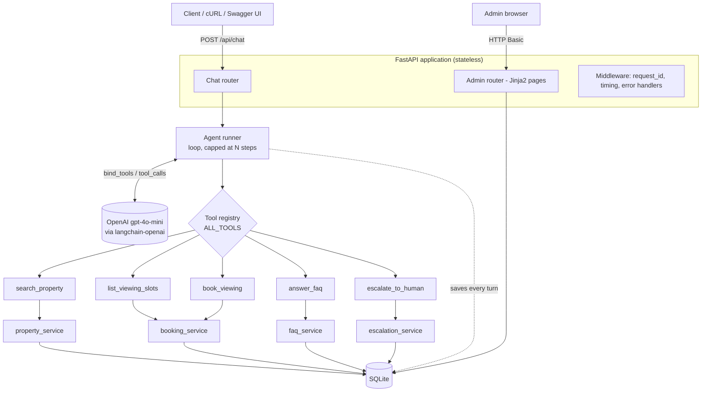

# Architecture

A backend service for a real estate AI assistant. A customer sends a message; an LLM
decides, on its own, which of the agency's tools to call; the tools run real business
logic against a database; the model turns the results into a reply.

The design goal was not feature count. It was to make the two things that usually rot in
an AI service — **where business logic lives** and **how you add the next capability** —
obvious and cheap to change.

---

## Diagram



*(Source: `docs/architecture.mmd`. GitHub renders this inline; paste it into
[mermaid.live](https://mermaid.live) to export a PNG.)*

---

## Layers

```
HTTP  ->  Router  ->  Agent runner  ->  Tool  ->  Service  ->  Database
          (I/O)       (LLM loop)       (adapter) (business    (sqlite3)
                                                  logic)
```

| Layer | Files | Responsibility |
|---|---|---|
| Router | `app/routers/` | HTTP only. Validate the body, call one function, shape the response. |
| Agent runner | `app/agent/runner.py` | The model loop and its guard rails. Owns conversation persistence. |
| Tool | `app/agent/tools/` | Adapter. Describes itself to the model, validates args, calls a service, returns JSON. |
| Service | `app/services/` | All business rules. Knows nothing about HTTP or the LLM. |
| Database | `app/database.py` | The only file that knows we use SQLite. |

### The rule that holds it together

**Tools contain no business logic.**

A tool's whole job is to describe a capability to the model, hand the arguments to a
service, and serialise the answer. Every rule — "a slot can only be booked once", "a
property must exist", "search is capped at 5 results" — lives in the service.

That single rule is what makes the rest cheap:

- `booking_service.create_booking()` is reachable from the agent, from a plain REST
  endpoint, from the admin page, and from a future cron job or a second agent, with no
  duplication and no re-testing.
- The business rules are testable without an LLM. `tests/test_services.py` runs in
  milliseconds and needs no API key.
- If we later replace the LLM, or drop the agent entirely for some flows, the rules stay
  exactly where they are.

---

## Agentic design

### Tool choice is the model's job

The requirement was that the AI picks the tool autonomously, with no keyword routing.
There is no `if "price" in message` anywhere in this codebase — it is greppable.

Three things make that work:

1. **Native function calling.** `llm.bind_tools(ALL_TOOLS)` sends every tool's JSON schema
   to OpenAI with each request. The model returns structured `tool_calls`; we execute them.
2. **The system prompt describes a role, not rules.** It says who the assistant is and what
   it must not invent. It does not say which tool to use when — that would be routing by
   another name.
3. **Tool docstrings are the selection signal.** Each docstring says *when* to reach for
   that tool, in the model's language. They are production code, not comments. When the
   model picks the wrong tool, the fix is the docstring, not an `if`.

### The loop

`run_agent()` in `app/agent/runner.py`:

1. Load prior turns from the database, save the incoming message.
2. Send `[system prompt] + [history] + [new message]` to the model.
3. No `tool_calls` in the reply? That is the final answer. Return it.
4. Otherwise run each requested tool, append its JSON as a `ToolMessage`, go back to 2.
5. Stop after `MAX_TOOL_ITERATIONS` regardless.

Every turn — user, tool JSON, assistant — is persisted, which is what makes the admin
conversation trace possible.

### Guard rails

| Risk | Mitigation |
|---|---|
| Model loops forever calling tools | `MAX_TOOL_ITERATIONS` cap, then a fallback reply |
| A tool raises and kills the request | `run_tool()` catches everything and returns `{"error": ...}` **to the model**, which can then apologise or offer another slot in the same turn |
| Model invents a tool name | Unknown names return an error object instead of a `KeyError` |
| Provider outage, bad key, rate limit | Caught, logged with full detail, surfaced as a clean `503` |
| Provider error text leaking to customers | The HTTP body carries a generic message; only the log has the provider's text |
| Model invents prices or policies | The prompt forbids it, and every fact comes from a tool |
| Slow provider | 30 s timeout, 2 retries |

### Why the reply carries `tools_used`

`POST /api/chat` returns the list of tools the model chose, in call order. That turns the
core requirement into something a reviewer can *see* in a `curl` response, rather than
something they have to take on trust after reading the logs.

---

## Extensibility

This was an explicit requirement, so it is worth being concrete about what "extensible"
actually costs here.

**Add a capability** — say, a mortgage calculator:

1. Write `app/agent/tools/estimate_mortgage.py` with an `@tool` function that calls a new
   `mortgage_service`.
2. Add two lines to `app/agent/tools/__init__.py`: the import, and the entry in `ALL_TOOLS`.

Nothing else changes. Not the runner, not the router, not the prompt. `/health` lists the
new tool on the next restart.

**Add a second agent** — say, a landlord-facing one: a different system prompt plus a
different subset of `ALL_TOOLS`. The runner already takes both as inputs.

**Swap the LLM provider:** `build_llm()` is the only function that names OpenAI.

**Swap the database:** `app/database.py` is the only file that imports `sqlite3`.

---

## Trade-offs I made on purpose

| Chose | Instead of | Why | When I would change it |
|---|---|---|---|
| SQLite | Postgres | Zero setup for a reviewer: clone and run | The first multi-replica deploy |
| Keyword-scored FAQ | Embeddings / RAG | 5 FAQs do not need a vector database, and it would have buried the actual point of the exercise | Past ~50 FAQs, or when phrasing gets fuzzy |
| Synchronous endpoints | `async def` | `sqlite3` and these client calls are blocking; `async` wrapped around blocking I/O looks scalable and is not | Moving to `asyncpg` and an async LLM client, together |
| Replay full history | Summarise older turns | Conversations are short; summarising adds an LLM call and a failure mode | When context cost or latency actually bites |
| Drop tool results from replayed history | Replay everything | The assistant's reply already contains the useful part; raw tool JSON is the biggest context cost with the least value | If the model started forgetting mid-booking details |
| HTTP Basic on `/admin` | Real auth / SSO | It is an internal MVP panel | Before it holds any real customer data |
| `langchain-core` + `langchain-openai` only | The full `langchain` package | We use `@tool`, the message types and `bind_tools`. Agent executors would add dependencies and hide the loop I want to be able to explain | If we needed LangGraph-style branching or checkpointing |
| Hardcoded viewing slots | Calendar integration | Not what the assessment is testing | Immediately, in a real build |

---

## Scaling to 100x traffic

The honest headline: **this service is I/O-bound, not CPU-bound.** Scaling it is mostly
about statelessness, caching the LLM, and keeping slow work off the request path. The
compute we do ourselves is trivial.

| Layer | Today | At 100x | Why it works |
|---|---|---|---|
| API | 1 uvicorn process | gunicorn + N uvicorn workers, replicas behind a load balancer | Endpoints are **stateless** — state is in the DB, so any replica serves any request |
| Conversation state | `messages` table | Postgres + Redis for hot conversations | Kills the read amplification of replaying history every turn |
| Data | SQLite file | Postgres, PgBouncer, read replicas for search | Only `app/database.py` changes |
| Property search | SQL `WHERE` | GIN index, or OpenSearch once filters get rich | The service boundary already isolates it |
| **LLM calls** | 1 sync call per turn | **The real bottleneck, and it is cost and latency, not CPU.** Semantic cache for FAQ answers, route simple turns to a smaller model, stream replies, per-tenant rate limits, circuit breaker and queue on 429s | Agent work is I/O-bound, so async workers scale it cheaply once the DB driver is async too |
| Slow tools | Inline | Push to a Celery/RQ queue, reply "I'm on it", notify by webhook | Keeps p99 request latency flat |
| Observability | JSON logs + `X-Request-ID` | Ship to Loki; OpenTelemetry traces spanning request → LLM call → tool → DB; Prometheus metrics on tool-choice distribution and token spend | The right fields are already being emitted |
| Failure isolation | try/except | Retry with backoff, circuit breaker per provider, fallback model | `build_llm()` is the single seam |

The first thing I would actually measure is the **tool-choice distribution** per model
version. A silent regression in tool selection is far more expensive than a latency
regression, and it is invisible without that metric.

---

## What I would do next, given another week

1. **Streaming responses** — the biggest perceived-latency win, and it changes the API
   contract, so it belongs early rather than late.
2. **An evaluation set**: ~50 labelled messages with their expected tool, run in CI.
   Prompt changes currently ship untested, which is the weakest point in this design.
3. **RAG over listing descriptions**, so "somewhere quiet near a good school" works.
4. **Real calendar integration** for viewing slots.
5. **Per-user rate limiting** and a token-spend budget per conversation.
